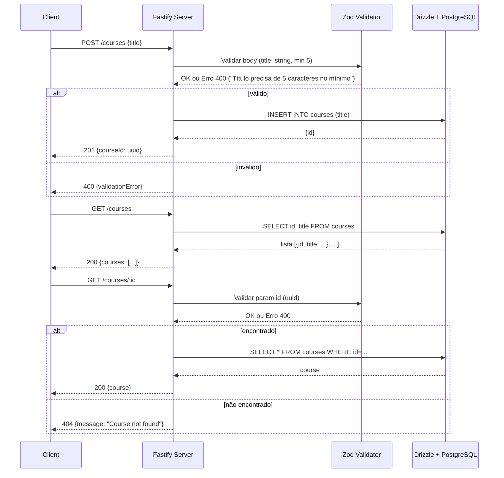

# Course Management API

Uma API REST desenvolvida em **Node.js** e **TypeScript** focada no gerenciamento de cursos. Este projeto foi criado como um desafio técnico para aplicar conceitos modernos de validação, documentação e ORM.

## 🛠️ Tecnologias Utilizadas

- **Node.js** + **TypeScript**
- **Fastify (v5)**: Framework web rápido e com baixo overhead.
- **Drizzle ORM**: Para interação com o banco de dados e gerenciamento de migrations.
- **PostgreSQL**: Banco de dados relacional (via Docker).
- **Zod**: Para validação de esquemas e tipagem forte (integrado via `fastify-type-provider-zod`).
- **Swagger (@scalar/fastify-api-reference)**: Documentação interativa da API gerada automaticamente.
- **Docker**: Containerização do banco de dados e ambiente.

---

## 🏗️ Estrutura do Projeto

A estrutura foi pensada para separar responsabilidades de rotas, esquemas de banco e configurações.

- `src/server.ts`: Ponto de entrada, configuração do Fastify e Swagger.
- `src/routes/`: Definição das rotas e validações Zod.
- `src/database/`: Configuração do cliente Drizzle e Schemas do banco.
- `drizzle.config.ts`: Configuração do Drizzle Kit.
- `docker-compose.yaml`: Orquestração dos serviços (App + DB).

---

## Documentação / Swagger
Quando `NODE_ENV` === "development":
- OpenAPI via `@fastify/swagger`
- UI de documentação em `/docs` via `@scalar/fastify-api-reference`
Acesse: `http://localhost:3333/docs` (apenas em dev)

---

## Fluxo principal (Mermaid)

Abaixo está o diagrama em Mermaid do fluxo principal da API em formato de sequência, seguindo fielmente o fluxo de validações e interações com o banco:

---
# Certificado 

