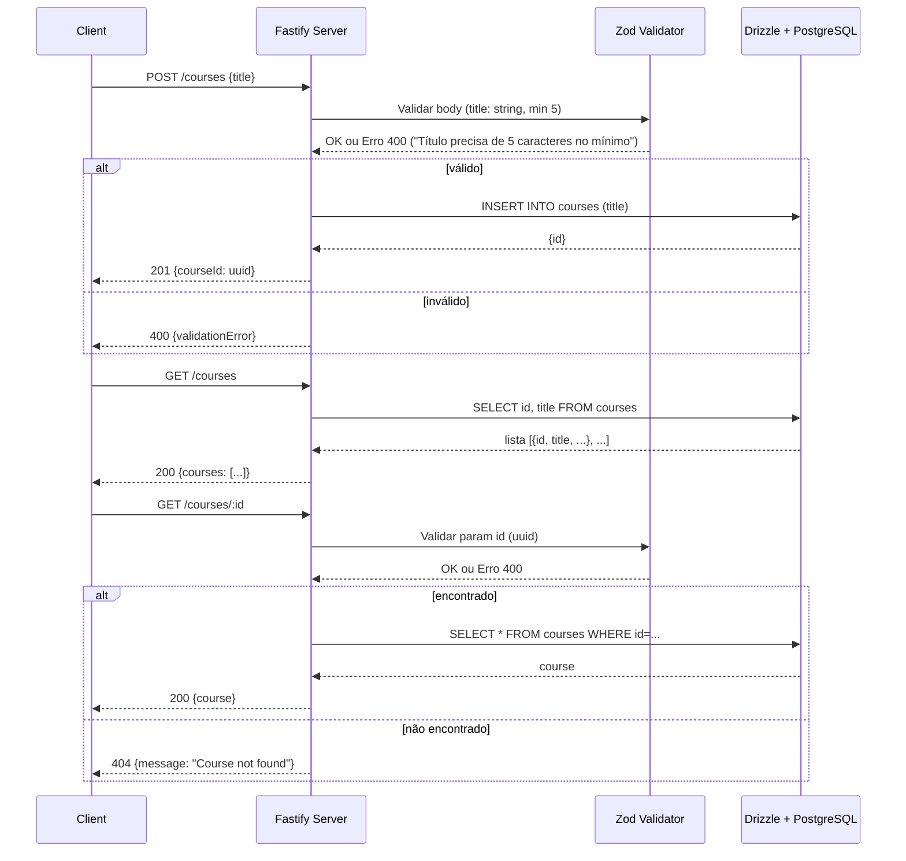

# API Node (Desafio)

Uma API em Node.js + TypeScript com Fastify, Zod (via fastify-type-provider-zod) e Drizzle ORM para PostgreSQL. Repositório criado como desafio com foco em gerenciamento de "courses" (cursos): criação, listagem e busca por ID.

---

## Tecnologias
- Node.js + TypeScript
- Fastify (v5)
- fastify-type-provider-zod (Zod para validação/serialização)
- @fastify/swagger + @scalar/fastify-api-reference (documentação em dev)
- Drizzle ORM / drizzle-kit (migrations/schema)
- PostgreSQL (Docker)

---

## Estrutura principal
- `server.ts` — ponto de entrada, registro de rotas e docs.
- `src/routes/create-courses.ts` — rota POST /courses (validação com Zod).
- `src/routes/get-courses.ts` — rota GET /courses (lista).
- `src/routes/get-courses-by-id.ts` — rota GET /courses/:id (validação do id).
- `src/database` — cliente e schema referenciados pelo Drizzle.
- `drizzle.config.ts` — configuração do drizzle-kit.
- `docker-compose.yaml` — serviços (app + db).
- `.env` — variáveis de ambiente.
- `requisicoes.http` — requests de exemplo.

---

## Variáveis de ambiente
Definidas em `.env`:
- NODE_ENV (ex.: "development")
- DATABASE_URL (ex.: `postgresql://postgres:postgres@db:5432/desafio`)

---

## Scripts úteis (package.json)
- `npm run dev` — roda o servidor em modo dev (watch).
- `npm run db:generate` — `drizzle-kit generate`
- `npm run db:migrate` — `drizzle-kit migrate`

---

## Como rodar localmente (desenvolvimento)
1. Subir o banco:
   - docker-compose up -d db
2. Instalar dependências:
   - npm install
3. Rodar a aplicação:
   - npm run dev
4. A aplicação ficará em `http://0.0.0.0:3333`

Observação: o `docker-compose.yaml` contém um serviço `app` configurado como `command: tail -f /dev/null` para facilitar o desenvolvimento com volumes. Ajuste conforme sua necessidade para iniciar automaticamente.

---

## Banco de dados / Migrations
- Configure `DATABASE_URL` no `.env`.
- Use `npm run db:generate` e `npm run db:migrate` conforme necessário.
- A configuração do Drizzle está em `drizzle.config.ts` e referencia o schema em `src/database/schema.ts`.

---

## Documentação / Swagger
Quando `NODE_ENV` === "development":
- OpenAPI via `@fastify/swagger`
- UI de documentação em `/docs` via `@scalar/fastify-api-reference`
Acesse: `http://localhost:3333/docs` (apenas em dev)

---

## Rotas e validações (detalhado)

Base: `http://localhost:3333`

1) POST /courses
- Descrição: Cria um curso.
- Validação (correspondente ao schema Zod do arquivo src/routes/create-courses.ts):
  - Body: 
    - title: string, mínimo 5 caracteres
    - Mensagem de validação usada: "Título precisa de 5 caracteres no mínimo"
- Resposta:
  - 201 Created
    - Body: { courseId: <uuid> }
  - 400 Bad Request (validação falhou)
- Exemplo de request (requisicoes.http):
  - POST http://localhost:3333/courses
    - Body:
      {
        "title": "Curso Exemplo"
      }

2) GET /courses
- Descrição: Retorna lista de cursos.
- Validação: nenhuma entrada obrigatória.
- Resposta:
  - 200 OK
    - Body: { courses: [ { id: <uuid>, title: <string>, ... } ] }

3) GET /courses/:id
- Descrição: Busca um curso por ID.
- Validação esperada:
  - Param:
    - id: UUID válido
- Respostas:
  - 200 OK — curso encontrado (retorna o objeto course)
  - 404 Not Found — curso não encontrado
  - 400 Bad Request — id inválido (validação Zod falhou)

---

## Exemplos de requisições (requisicoes.http)
O repositório já contém `requisicoes.http` com exemplos mínimos:

```
POST http://localhost:3333/courses
Content-Type: application/json

{
    "title": "Cur"
}

###
GET http://localhost:3333/courses

###
GET http://localhost:3333/courses/47ebaeb0-5833-4790-a51f-a9df600508e6
```

Exemplo curl para criar curso:
```
curl -X POST http://localhost:3333/courses \
  -H "Content-Type: application/json" \
  -d '{"title":"Curso Exemplo"}'
```

---

## Fluxo principal (Mermaid)

Abaixo está o diagrama em Mermaid do fluxo principal da API em formato de sequência, seguindo fielmente o fluxo de validações e interações com o banco:



---

## Observações sobre validações extraídas
- A validação exata do POST /courses foi extraída diretamente de `src/routes/create-courses.ts`:
  - z.object({ title: z.string().min(5, 'Título precisa de 5 caracteres no mínimo') })
  - Resposta 201: z.object({ courseId: z.uuid() }).describe('Curso criado com sucesso')
- Os demais comportamentos (GET /courses e GET /courses/:id) seguem o padrão esperado em APIs REST e são descritos conforme o uso comum e os imports/registro em `server.ts`. Se desejar, posso incluir aqui as definições Zod exatas extraídas dos arquivos `src/routes/get-courses.ts` e `src/routes/get-courses-by-id.ts` para complementar com precisão total.

---

## Contribuição
- Para melhorias: abrir issue ou PR.